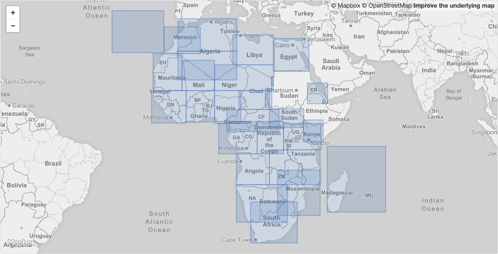

`Titiler` has a native support for reading and creating web map tile from **MosaicJSON**.

> MosaicJSON is an open standard for representing metadata about a mosaic of Cloud-Optimized GeoTIFF (COG) files.

Ref: https://github.com/developmentseed/mosaicjson-spec

[TODO]

### Links

- https://medium.com/devseed/cog-talk-part-2-mosaics-bbbf474e66df
- https://github.com/developmentseed/cogeo-mosaic
