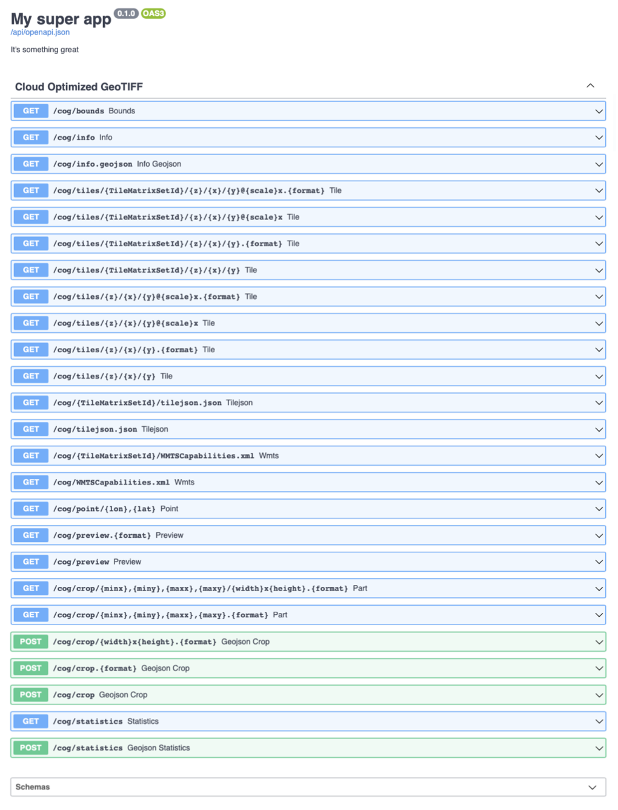

`TiTiler` is a set of python modules whose goal are to help users in creating a dynamic tile server. To learn more about `dynamic tiling` please refer to the [docs](dynamic_tiling.md).

Users can choose to extend or use `Titiler` as it is.

## Defaults

`TiTiler` comes with a default (complete) application with support for COG, STAC and MosaicJSON. You can start the application locally by doing:

```bash
$ pip install titiler.application uvicorn
$ uvicorn titiler.application.main:app --reload

> INFO: Uvicorn running on http://127.0.0.1:8000 (Press CTRL+C to quit)
> INFO: Started reloader process [45592]
```

See default endpoints documentation pages:

* [`/cog` - Cloud Optimized GeoTIFF](endpoints/cog.md)
* [`/mosaicjson` - MosaicJSON](endpoints/mosaic.md)
* [`/stac` - Spatio Temporal Asset Catalog](endpoints/stac.md)
* [`/tms` - TileMatrixSets](endpoints/tms.md)

## Customized, minimal app

`TiTiler` has been developed so users can build their own app using only the portions they need. Using [TilerFactories](advanced/tiler_factories.md), users can create a fully customized application with only the endpoints needed.

```python
from titiler.core.factory import TilerFactory
from titiler.core.errors import DEFAULT_STATUS_CODES, add_exception_handlers

from fastapi import FastAPI

from starlette.requests import Request
from starlette.responses import HTMLResponse

app = FastAPI(
    title="My super app",
    openapi_url="/api/openapi.json",
    description="It's something great",
)

cog = TilerFactory(router_prefix="cog")
app.include_router(cog.router, prefix="/cog", tags=["Cloud Optimized GeoTIFF"])
add_exception_handlers(app, DEFAULT_STATUS_CODES)
```



## Extending TiTiler's app

If you want to include all of Titiler's built-in endpoints, but also include
customized endpoints, you can import and extend the app directly:

```py
from titiler.application.main import app
from titiler.core.factory import TilerFactory

# Create a custom Tiler (see: https://github.com/developmentseed/titiler-pds/blob/master/app/routes/naip.py)
tiler = TilerFactory(
    router=router,
    prefix="private/cog",
    gdal_config={"AWS_REQUEST_PAYER": "requester"},
)

app.include_router(
    tiler.router,
    prefix="/private/cog",
    tags=["Custom Tiler"]
)
```

More on [customization](advanced/customization.md)
