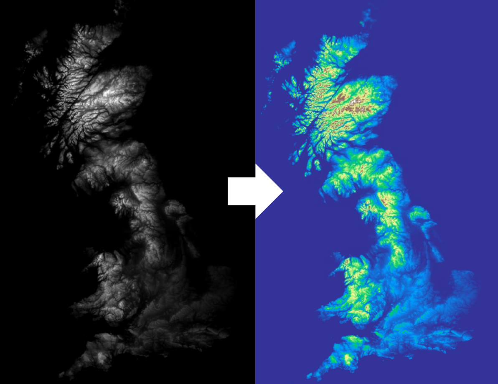

# Rendering Options

When using Titiler to visualize imagery, there are some helper options that change how the data appears on the screen. You can:
1. Adjust band values using basic color-oriented image operations
2. Apply color maps to create heat maps, colorful terrain based on band value
3. Rescale images on a per-band basis

## Color Maps

Color maps are arrays of colors, used to map pixel values to specific colors. For example, it is possible to map a single band DEM, where pixel values denote height, to a color map which shows higher values as white:



Titiler supports both default colormaps (each with a name) and custom color maps.

### Default Colormaps

Default colormaps pre-made, each with a given name. These maps come from the `rio-tiler` library, which has taken colormaps packaged with Matplotlib and has added others that are commonly used with raster data. 

A list of available color maps can be found in Titiler's Swagger docs, or in the [rio-tiler](https://cogeotiff.github.io/rio-tiler/colormap/) documentation.

To use a default colormap, simply use the parameter `colormap_name`:

```python3
import requests

resp = requests.get("titiler.xyz/cog/preview", params={
    "url": "<YOUR COG HERE>",
    "colormap_name": "<YOUR COLORMAP NAME HERE>" # e.g. autumn_r
})
```

You can take any of the colormaps listed on `rio-tiler`, and add `_r` to reverse it.

### Custom Colormaps

If you'd like to specify your own colormap, you can specify your own using a JSON:

```python3 
import requests

response = requests.get(
    f"titiler.xyz/cog/preview",
    params={
        "url": "<YOUR COG HERE>",
        "bidx": "1",
        "colormap": {
                "0": "#e5f5f9",
                "10": "#99d8c9",
                "255": "#2ca25f",
            }
    }
)
```

Titiler supports colormaps that are both discrete (where pixels will be one of the colors that you specify) and linear (where pixel colors will blend between the given colors).

For more information, please check out [rio-tiler's docs](https://cogeotiff.github.io/rio-tiler/colormap/).

## Color Formulae

Color formulae are simple commands that apply color corrections to images. This is useful for reducing artefacts like atmospheric haze, dark shadows, or muted colors.

Titiler supports color formulae as defined in [Mapbox's `rio-color` plugin](https://github.com/mapbox/rio-color). These include the operations ([taken from the `rio-color` docs](https://github.com/mapbox/rio-color#operations)):

- **Gamma** adjustment adjusts RGB values according to a power law, effectively brightening or darkening the midtones. It can be very effective in satellite imagery for reducing atmospheric haze in the blue and green bands.

- **Sigmoidal** contrast adjustment can alter the contrast and brightness of an image in a way that matches human's non-linear visual perception. It works well to increase contrast without blowing out the very dark shadows or already-bright parts of the image.

- **Saturation** can be thought of as the "colorfulness" of a pixel. Highly saturated colors are intense and almost cartoon-like, low saturation is more muted, closer to black and white. You can adjust saturation independently of brightness and hue but the data must be transformed into a different color space.

In Titiler, color_formulae are applied through the `color_formula` parameter. An example of this option in action:

```python3
import requests

response = requests.get(
    f"titiler.xyz/cog/preview",
    params={
        "url": "<YOUR COG HERE>",
        "color_formula": "gamma rg 1.3, sigmoidal rgb 22 0.1, saturation 1.5"
    }
)
```

## Rescaling