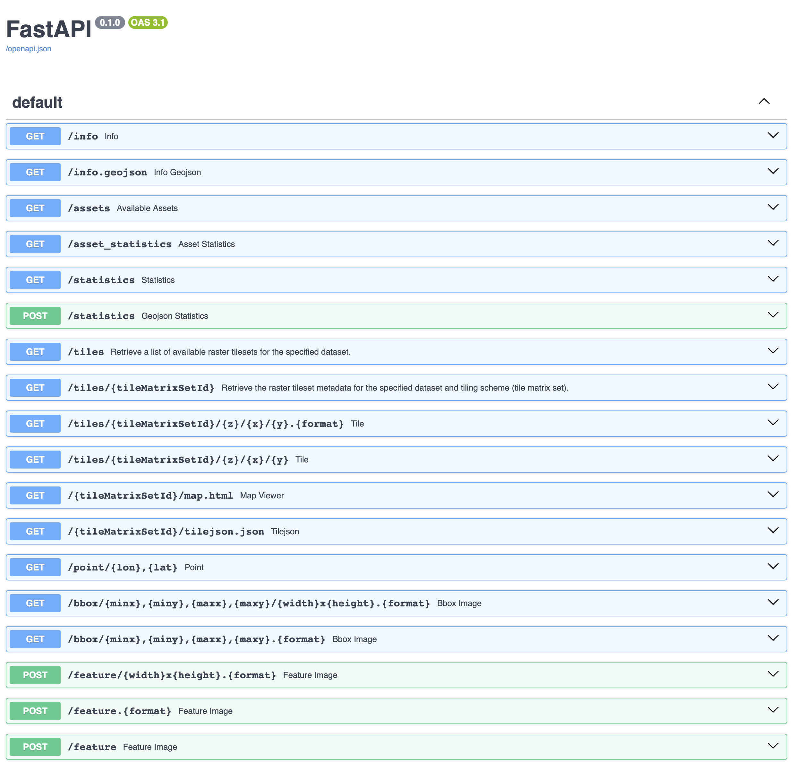

**Goal**: Create a custom STAC Reader supporting both COG and NetCDF/Zarr dataset

**requirements**:

- `titiler.core`
- `titiler.xarray`
- `fsspec`
- `zarr`
- `h5netcdf`
- `aiohttp` (optional)
- `s3fs` (optional)

**links**:

- https://cogeotiff.github.io/rio-tiler/examples/STAC_datacube_support/


#### 1. Custom STACReader

First, we need to create a custom `STACReader` which will support both COG and NetCDF/Zarr dataset. The custom parts will be:

- add `netcdf` and `zarr` as valid asset media types
- introduce a new `md://` prefixed asset form, so users can pass `assets=md://{netcdf asset name}?variable={variable name}` as we do for the `GDAL vrt string connection` support.

```python title="stac.py"
import attr
from urllib.parse import urlparse, parse_qsl
from rio_tiler.types import AssetInfo
from rio_tiler.io import BaseReader, Reader
from rio_tiler.io.stac import DEFAULT_VALID_TYPE, STAC_ALTERNATE_KEY
from rio_tiler.io.stac import STACReader as BaseSTACReader

from titiler.xarray.io import FsReader as XarrayReader

valid_types = {
    *DEFAULT_VALID_TYPE,
    "application/x-netcdf",
    "application/vnd+zarr",
}


@attr.s
class STACReader(BaseSTACReader):
    """Custom STACReader which adds support for XarrayReader.

    Example:
    >>> with STACReader("https://raw.githubusercontent.com/cogeotiff/rio-tiler/refs/heads/main/tests/fixtures/stac_netcdf.json") as src:
            print(src.assets)
            print(src._get_asset_info("netcdf|variable=dataset"))

        ['geotiff', 'netcdf']
        {'url': 'https://raw.githubusercontent.com/cogeotiff/rio-tiler/refs/heads/main/tests/fixtures/dataset_2d.nc', 'name': 'netcdf', 'metadata': {}, 'reader_options': {'variable': 'dataset'}, 'method_options': {}, 'media_type': 'application/x-netcdf'}

    """
    include_asset_types: set[str] = attr.ib(default=valid_types)

    def _get_reader(self, asset_info: AssetInfo) -> type[BaseReader]:
        """Get Asset Reader."""
        asset_type = asset_info.get("media_type", None)
        if asset_type and asset_type in [
            "application/x-netcdf",
            "application/vnd+zarr",
            "application/x-hdf5",
            "application/x-hdf",
        ]:
            return XarrayReader

        return Reader

    def _get_asset_info(self, asset: str) -> AssetInfo:
        """Validate asset names and return asset's info.

        Args:
            asset (str): STAC asset name.

        Returns:
            AssetInfo: STAC asset info.

        """
        asset, vrt_options = self._parse_vrt_asset(asset)
        
        reader_options: dict[str, Any] = {}
        method_options: dict[str, Any] = {}
        # NOTE: asset can be in form of
        # "{asset_name}|some_option=some_value&another_option=another_value"
        if "|" in asset:
            asset, params = asset.split("|", 1)
            # NOTE: Construct method options from params
            if params:
                for param in params.split("&"):
                    key, value = param.split("=", 1)
                    if key == "indexes":
                        method_options["indexes"] = list(map(int, value.split(",")))
                    elif key == "expression":
                        method_options["expression"] = value
                    # XarrayReader Reader-Options
                    elif key == "variable":
                        reader_options["variable"] = value
                    elif key == "group":
                        reader_options["group"] = value
                    elif key == "decode_times":
                        reader_options["decode_times"] = value.lower() in ["true", "yes", "1"]
                    elif key == "datetime":
                        reader_options["datetime"] = value
                    elif key == "drop_dim":
                        reader_options["drop_dim"] = value
                                                                                                                  
        if asset not in self.assets:
            raise InvalidAssetName(
                f"'{asset}' is not valid, should be one of {self.assets}"
            )

        asset_info = self.item.assets[asset]
        extras = asset_info.extra_fields

        info = AssetInfo(
            url=asset_info.get_absolute_href() or asset_info.href,
            name=asset,
            metadata=extras if not vrt_options else None,
            reader_options=reader_options,
            method_options=method_options,
        )

        if STAC_ALTERNATE_KEY and extras.get("alternate"):
            if alternate := extras["alternate"].get(STAC_ALTERNATE_KEY):
                info["url"] = alternate["href"]

        if asset_info.media_type:
            info["media_type"] = asset_info.media_type

        # https://github.com/stac-extensions/file
        if head := extras.get("file:header_size"):
            info["env"] = {"GDAL_INGESTED_BYTES_AT_OPEN": head}

        # https://github.com/stac-extensions/raster
        if extras.get("raster:bands") and not vrt_options:
            bands = extras.get("raster:bands")
            stats = [
                (b["statistics"]["minimum"], b["statistics"]["maximum"])
                for b in bands
                if {"minimum", "maximum"}.issubset(b.get("statistics", {}))
            ]
            # check that stats data are all double and make warning if not
            if (
                stats
                and all(isinstance(v, (int, float)) for stat in stats for v in stat)
                and len(stats) == len(bands)
            ):
                info["dataset_statistics"] = stats
            else:
                warnings.warn(
                    "Some statistics data in STAC are invalid, they will be ignored."
                )

        if vrt_options:
            info["url"] = f"vrt://{info['url']}?{vrt_options}"

        return info
```

#### 2. Application

```python title="main.py"
"""FastAPI application."""
from fastapi import FastAPI
from titiler.core.factory import MultiBaseTilerFactory
from titiler.core.errors import DEFAULT_STATUS_CODES, add_exception_handlers

from .stac import STACReader

# STAC uses MultiBaseReader so we use MultiBaseTilerFactory to built the default endpoints
stac = MultiBaseTilerFactory(
    reader=STACReader, 
    add_preview=False, 
    add_ogc_maps=False,
)

# Create FastAPI application
app = FastAPI()
app.include_router(stac.router)
add_exception_handlers(app, DEFAULT_STATUS_CODES)
```

```
uvicorn app:app --port 8080 --reload
```



##### Available Assets

```bash
curl http://127.0.0.1:8080/assets\?url\=https%3A%2F%2Fraw.githubusercontent.com%2Fcogeotiff%2Frio-tiler%2Frefs%2Fheads%2Fmain%2Ftests%2Ffixtures%2Fstac_netcdf.json | jq

[
  "geotiff",
  "netcdf"
]
```

##### Info

```bash
curl http://127.0.0.1:8080/info?url=https://raw.githubusercontent.com/cogeotiff/rio-tiler/refs/heads/main/tests/fixtures/stac_netcdf.json&assets=netcdf|variable=dataset  | jq
{
  "netcdf|variable=dataset": {
    "bounds": [
      -170.085,
      -80.08,
      169.914999999975,
      79.91999999999659
    ],
    "crs": "http://www.opengis.net/def/crs/EPSG/0/4326",
    "band_metadata": [
      [
        "b1",
        {}
      ]
    ],
    "band_descriptions": [
      [
        "b1",
        "dataset"
      ]
    ],
    "dtype": "float64",
    "nodata_type": "Nodata",
    "name": "dataset",
    "count": 1,
    "width": 2000,
    "height": 1000,
    "dimensions": [
      "y",
      "x"
    ],
    "attrs": {
      "valid_min": 1.0,
      "valid_max": 1000.0,
      "fill_value": 0
    }
  }
}
```

#####  Map.html 

```
http://127.0.0.1:8080/WebMercatorQuad/map.html?url=https://raw.githubusercontent.com/cogeotiff/rio-tiler/refs/heads/main/tests/fixtures/stac_netcdf.json&assets=netcdf|variable=dataset&rescale=0,1000&colormap_name=viridis
```


##### Tile Request

```
http://127.0.0.1:8080/tiles/WebMercatorQuad/1/0/0?url=https://raw.githubusercontent.com/cogeotiff/rio-tiler/refs/heads/main/tests/fixtures/stac_netcdf.json&assets=netcdf|variable=dataset&rescale=0,1000
```


