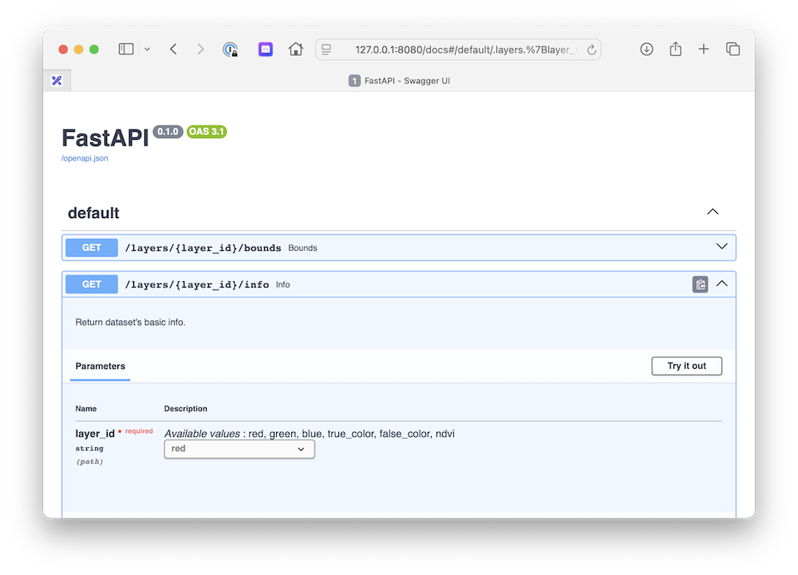

**Goal**: Create a Custom TiTiler with a limited set of supported `layers`

**requirements**: titiler.core

**How**:

The idea is to create a set of endpoints with a `/layers/{layer_id}` prefix and a set of configuration, e.g

```
config = {
    "layer_1": {
        "url": "dataset_1 url",
        "indexes": [1],
        "render": {
            "rescale": [(0, 1000)],
            "colormap_name": "viridis"
        }
    },
    ...
}
```

We then use custom set of endpoint dependencies to get the `layer` configuration and `inject` the parameters.


```python
import json
from dataclasses import dataclass, field
from typing import Dict, Literal, Annotated, Optional, Sequence

from fastapi import FastAPI, Path, HTTPException, Query
from rio_tiler.colormap import ColorMaps
from rio_tiler.colormap import cmap as default_cmap
from rio_tiler.colormap import parse_color
from starlette.requests import Request

from titiler.core import dependencies
from titiler.core.errors import DEFAULT_STATUS_CODES, add_exception_handlers
from titiler.core.factory import TilerFactory


# Layers Configuration
available_layers = {
    "red": {
        "url": "https://sentinel-cogs.s3.us-west-2.amazonaws.com/sentinel-s2-l2a-cogs/21/J/XN/2021/2/S2B_21JXN_20210214_1_L2A/B04.tif",
        "render": {
            "rescale": [
                (0, 1000),
            ],
        },
    },
    "green": {
        "url": "https://sentinel-cogs.s3.us-west-2.amazonaws.com/sentinel-s2-l2a-cogs/21/J/XN/2021/2/S2B_21JXN_20210214_1_L2A/B03.tif",
        "render": {
            "rescale": [
                (0, 1000),
            ],
        },
    },
    "bleue": {
        "url": "https://sentinel-cogs.s3.us-west-2.amazonaws.com/sentinel-s2-l2a-cogs/21/J/XN/2021/2/S2B_21JXN_20210214_1_L2A/B02.tif",
        "render": {
            "rescale": [
                (0, 1000),
            ],
        },
    },
}

# VRT of bands B04, B03, B02, and B05 files
# gdalbuildvrt vrt.vrt /vsicurl/https://sentinel-cogs.s3.us-west-2.amazonaws.com/sentinel-s2-l2a-cogs/21/J/XN/2021/2/S2B_21JXN_20210214_1_L2A/B{04,03,02,08}.tif -separate
# cat vrt.vrt | tr -d '\n' | tr -d ' '
vrt_rdbnir = '<VRTDataset rasterXSize="10980" rasterYSize="10980">  <SRS dataAxisToSRSAxisMapping="1,2">PROJCS["WGS 84 / UTM zone 21S",GEOGCS["WGS 84",DATUM["WGS_1984",SPHEROID["WGS 84",6378137,298.257223563,AUTHORITY["EPSG","7030"]],AUTHORITY["EPSG","6326"]],PRIMEM["Greenwich",0,AUTHORITY["EPSG","8901"]],UNIT["degree",0.0174532925199433,AUTHORITY["EPSG","9122"]],AUTHORITY["EPSG","4326"]],PROJECTION["Transverse_Mercator"],PARAMETER["latitude_of_origin",0],PARAMETER["central_meridian",-57],PARAMETER["scale_factor",0.9996],PARAMETER["false_easting",500000],PARAMETER["false_northing",10000000],UNIT["metre",1,AUTHORITY["EPSG","9001"]],AXIS["Easting",EAST],AXIS["Northing",NORTH],AUTHORITY["EPSG","32721"]]</SRS>  <GeoTransform>  6.0000000000000000e+05,  1.0000000000000000e+01,  0.0000000000000000e+00,  7.3000000000000000e+06,  0.0000000000000000e+00, -1.0000000000000000e+01</GeoTransform>  <VRTRasterBand dataType="UInt16" band="1">    <NoDataValue>0</NoDataValue>    <ComplexSource>      <SourceFilename relativeToVRT="0">/vsicurl/https://sentinel-cogs.s3.us-west-2.amazonaws.com/sentinel-s2-l2a-cogs/21/J/XN/2021/2/S2B_21JXN_20210214_1_L2A/B04.tif</SourceFilename>      <SourceBand>1</SourceBand>      <SourceProperties RasterXSize="10980" RasterYSize="10980" DataType="UInt16" BlockXSize="1024" BlockYSize="1024" />      <SrcRect xOff="0" yOff="0" xSize="10980" ySize="10980" />      <DstRect xOff="0" yOff="0" xSize="10980" ySize="10980" />      <NODATA>0</NODATA>    </ComplexSource>  </VRTRasterBand>  <VRTRasterBand dataType="UInt16" band="2">    <NoDataValue>0</NoDataValue>    <ComplexSource>      <SourceFilename relativeToVRT="0">/vsicurl/https://sentinel-cogs.s3.us-west-2.amazonaws.com/sentinel-s2-l2a-cogs/21/J/XN/2021/2/S2B_21JXN_20210214_1_L2A/B03.tif</SourceFilename>      <SourceBand>1</SourceBand>      <SourceProperties RasterXSize="10980" RasterYSize="10980" DataType="UInt16" BlockXSize="1024" BlockYSize="1024" />      <SrcRect xOff="0" yOff="0" xSize="10980" ySize="10980" />      <DstRect xOff="0" yOff="0" xSize="10980" ySize="10980" />      <NODATA>0</NODATA>    </ComplexSource>  </VRTRasterBand>  <VRTRasterBand dataType="UInt16" band="3">    <NoDataValue>0</NoDataValue>    <ComplexSource>      <SourceFilename relativeToVRT="0">/vsicurl/https://sentinel-cogs.s3.us-west-2.amazonaws.com/sentinel-s2-l2a-cogs/21/J/XN/2021/2/S2B_21JXN_20210214_1_L2A/B02.tif</SourceFilename>      <SourceBand>1</SourceBand>      <SourceProperties RasterXSize="10980" RasterYSize="10980" DataType="UInt16" BlockXSize="1024" BlockYSize="1024" />      <SrcRect xOff="0" yOff="0" xSize="10980" ySize="10980" />      <DstRect xOff="0" yOff="0" xSize="10980" ySize="10980" />      <NODATA>0</NODATA>    </ComplexSource>  </VRTRasterBand>  <VRTRasterBand dataType="UInt16" band="4">    <NoDataValue>0</NoDataValue>    <ComplexSource>      <SourceFilename relativeToVRT="0">/vsicurl/https://sentinel-cogs.s3.us-west-2.amazonaws.com/sentinel-s2-l2a-cogs/21/J/XN/2021/2/S2B_21JXN_20210214_1_L2A/B08.tif</SourceFilename>      <SourceBand>1</SourceBand>      <SourceProperties RasterXSize="10980" RasterYSize="10980" DataType="UInt16" BlockXSize="1024" BlockYSize="1024" />      <SrcRect xOff="0" yOff="0" xSize="10980" ySize="10980" />      <DstRect xOff="0" yOff="0" xSize="10980" ySize="10980" />      <NODATA>0</NODATA>    </ComplexSource>  </VRTRasterBand></VRTDataset>'

# Mpre configs (using VRT)
available_layers.update(
    {
        "true_color": {
            "url": vrt_rdbnir,
            "indexes": [1, 2, 3],
            "render": {
                "rescale": [
                    (0, 3000),
                    (0, 3000),
                    (0, 3000),
                ],
            },
        },
        "false_color": {
            "url": vrt_rdbnir,
            "indexes": [4, 1, 2],
            "render": {
                "rescale": [
                    (0, 4000),
                    (0, 3000),
                    (0, 3000),
                ],
            },
        },
        "ndvi": {
            "url": vrt_rdbnir,
            "expression": "(b4-b1)/(b4+b1)",
            "render": {
                "rescale": [
                    (-1, 1),
                ],
                "colormap_name": "viridis",
            },
        },
    }
)

# List of all Layers
layers_list = Literal["red", "green", "blue", "true_color", "false_color", "ndvi"]


# Custom `DatasetPathParams` which return the dataset URL for a `layer_id`
def DatasetPathParams(layer_id: layers_list = Path()) -> str:
    return available_layers[layer_id]["url"]


@dataclass
class CustomAsDict:
    """Custom `DefaultDependency` to ignore `requests`"""
    def as_dict(self, exclude_none: bool = True) -> Dict:
        """Transform dataclass to dict."""
        exclude_keys = {"request"}
        if exclude_none:
            return {
                k: v
                for k, v in self.__dict__.items()
                if v is not None and k not in exclude_keys
            }

        return {k: v for k, v in self.__dict__.items() if k not in exclude_keys}


# Custom Layer Param
@dataclass
class LayerParams(CustomAsDict, dependencies.BidxExprParams):

    request: Request = field(default=None)

    def __post_init__(self):
        if (layer := self.request.path_params.get("layer_id")) and not any(
            [self.indexes, self.expression]
        ):
            layer_params = available_layers[layer]
            if indexes := layer_params.get("indexes"):
                self.indexes = indexes
            elif expr := layer_params.get("expression"):
                self.expression = expr

# Custom Rendering Params
@dataclass
class RenderingParams(CustomAsDict, dependencies.ImageRenderingParams):

    request: Request = field(default=None)

    def __post_init__(self):
        super().__post_init__()

        if layer := self.request.path_params.get("layer_id"):
            layer_params = available_layers[layer].get("render", {})

            if not self.rescale and (rescale := layer_params.get("rescale")):
                self.rescale = rescale

            if not self.color_formula and (color_formula := layer_params.get("color_formula")):
                self.color_formula = color_formula

            if self.add_mask is not None and (add_mask := layer_params.get("add_mask")):
                self.add_mask = add_mask


# Custom ColorMap Params
def ColorMapParams(
    request: Request,
    colormap_name: Annotated[  # type: ignore
        Literal[tuple(default_cmap.list())],
        Query(description="Colormap name"),
    ] = None,
    colormap: Annotated[
        Optional[str], Query(description="JSON encoded custom Colormap")
    ] = None,
):
    if layer := request.path_params.get("layer_id"):
        layer_params = available_layers[layer].get("render", {})
        colormap_name = layer_params.get("colormap_name", colormap_name)
        colormap = layer_params.get("colormap", colormap)

    if colormap_name:
        return default_cmap.get(colormap_name)

    if colormap:
        try:
            c = json.loads(
                colormap,
                object_hook=lambda x: {
                    int(k): parse_color(v) for k, v in x.items()
                },
            )

            # Make sure to match colormap type
            if isinstance(c, Sequence):
                c = [(tuple(inter), parse_color(v)) for (inter, v) in c]

            return c
        except json.JSONDecodeError as e:
            raise HTTPException(
                status_code=400, detail="Could not parse the colormap value."
            ) from e

    return None


app = FastAPI()

cog = TilerFactory(
    path_dependency=DatasetPathParams,
    layer_dependency=LayerParams,
    render_dependency=RenderingParams,
    colormap_dependency=ColorMapParams,
    router_prefix="/layers/{layer_id}",
)
app.include_router(cog.router, prefix="/layers/{layer_id}")
add_exception_handlers(app, DEFAULT_STATUS_CODES)

# Run the application
import uvicorn
uvicorn.run(app=app, host="127.0.0.1", port=8080, log_level="info")
```


`http://127.0.0.1:8080/docs`




`http://127.0.0.1:8080/layers/true_color/preview`


