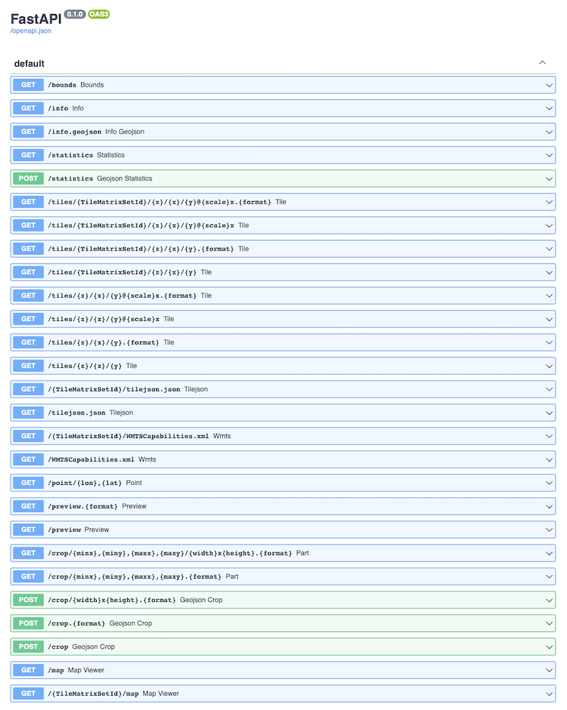

`TiTiler` is a set of python modules whose goal are to help users in creating a dynamic tile server. To learn more about `dynamic tiling` please refer to the [docs](dynamic_tiling.md).

Users can choose to extend or use `TiTiler` as it is.

## Default Application

`TiTiler` comes with a default (complete) application with support for COG, STAC, and MosaicJSON. You can install and start the application locally by doing:

```bash
# Update pip
python -m pip install -U pip

# Install titiler packages
python -m pip install uvicorn titiler.application

# Start application using uvicorn
uvicorn titiler.application.main:app

> INFO: Uvicorn running on http://127.0.0.1:8000 (Press CTRL+C to quit)
```

See default endpoints documentation pages:

* [`/cog` - Cloud Optimized GeoTIFF](endpoints/cog.md)
* [`/mosaicjson` - MosaicJSON](endpoints/mosaic.md)
* [`/stac` - Spatio Temporal Asset Catalog](endpoints/stac.md)
* [`/tileMatrixSets` - Tiling Schemes](endpoints/tms.md)
* [`/algorithms` - Algorithms](endpoints/algorithms.md)
* [`/colorMaps` - ColorMaps](endpoints/colormaps.md)

#### Settings

The default application can be customized using environment variables defined in `titiler.application.settings.ApiSettings` class. Each variable needs to be prefixed with `TITILER_API_`.

- `NAME` (str): name of the application. Defaults to `titiler`.
- `CORS_ORIGINS` (str, `,` delimited origins): allowed CORS origin. Defaults to `*`.
- `CORS_ALLOW_METHODS` (str, `,` delimited methods): allowed CORS methods. Defaults to `GET`.
- `CACHECONTROL` (str): Cache control header to add to responses. Defaults to `"public, max-age=3600"`.
- `ROOT_PATH` (str): path behind proxy.
- `DEBUG` (str): adds `LoggerMiddleware` and `TotalTimeMiddleware` in the middleware stack.
- `DISABLE_COG` (bool): disable `/cog` endpoints.
- `DISABLE_STAC` (bool): disable `/stac` endpoints.
- `DISABLE_MOSAIC` (bool): disable `/mosaic` endpoints.
- `LOWER_CASE_QUERY_PARAMETERS` (bool): transform all query-parameters to lower case (see https://github.com/developmentseed/titiler/pull/321).
- `GLOBAL_ACCESS_TOKEN` (str | None): a string which is required in the `?access_token=` query param with every request.

## Customized, minimal app

`TiTiler` has been developed so users can build their own application with only the endpoints they need. Using [Factories](advanced/endpoints_factories.md), users can create a fully customized application with only a defined set of endpoints.

When building a custom application, you may wish to only install the `core` and/or `mosaic` modules. To install these from PyPI:

```bash
# Update pip
python -m pip install -U pip

# Install titiler.core and uvicorn packages
python -m pip install titiler.core uvicorn
```

These can then be used like:

```py
# app.py
import uvicorn
from titiler.core.factory import TilerFactory
from titiler.core.errors import DEFAULT_STATUS_CODES, add_exception_handlers

from fastapi import FastAPI

app = FastAPI()
cog = TilerFactory()
app.include_router(cog.router)
add_exception_handlers(app, DEFAULT_STATUS_CODES)


if __name__ == '__main__':
    uvicorn.run(app=app, host="127.0.0.1", port=8080, log_level="info")
```



## Extending TiTiler's app

If you want to include all of Titiler's built-in endpoints, but also include
customized endpoints, you can import and extend the app directly.

```bash
python -m pip install titiler.application uvicorn # also installs titiler.core and titiler.mosaic
```

These can then be used like:


```py
# Add private COG endpoints requiring token validation
from fastapi import APIRouter, Depends, HTTPException, Security
from fastapi.security.api_key import APIKeyQuery

from titiler.application.main import app
from titiler.core.factory import TilerFactory

import uvicorn

api_key_query = APIKeyQuery(name="access_token", auto_error=False)


def token_validation(access_token: str = Security(api_key_query)):
    """stupid token validation."""
    if not access_token:
        raise HTTPException(status_code=401, detail="Missing `access_token`")

    # if access_token == `token` then OK
    if not access_token == "token":
        raise HTTPException(status_code=401, detail="Invalid `access_token`")

    return True


# Custom router with token dependency
router = APIRouter(dependencies=[Depends(token_validation)])
tiler = TilerFactory(router_prefix="private/cog", router=router)

app.include_router(tiler.router, prefix="/private/cog", tags=["Private"])


if __name__ == '__main__':
    uvicorn.run(app=app, host="127.0.0.1", port=8080, log_level="info")
```

More on [customization](advanced/customization.md)
