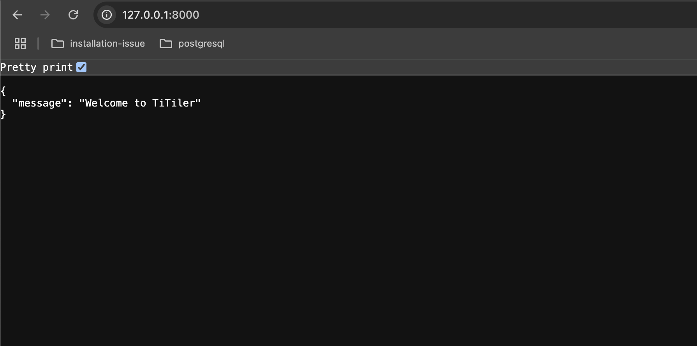
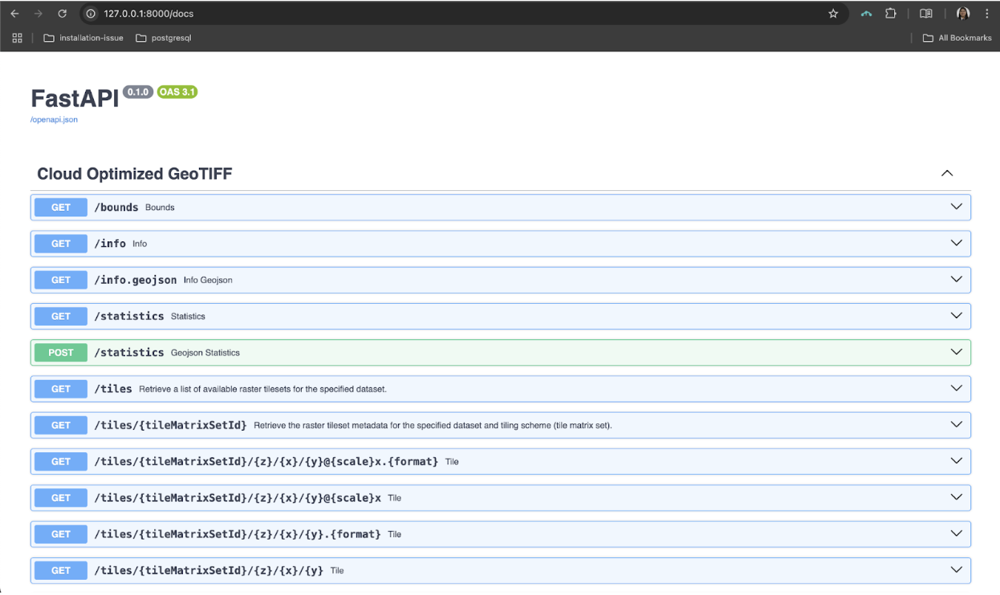

[TiTiler](https://developmentseed.org/titiler) is a modern map tile server that helps developers quickly serve geospatial data on the web. Think of it as a specialized tool that takes large geographic files (like satellite imagery) and slices them into small, web-friendly map tiles that load efficiently in browser-based maps.

Built on FastAPI, TiTiler makes working with Cloud-Optimized GeoTIFFs, Spatio Temporal Asset Catalog and other spatial data formats straightforward, even if you're not a GIS expert. It handles all the complex work of processing geographic data and serving it through simple API endpoints that any web developer can use.

In the past, putting maps on websites was a real pain. Developers had to use bulky tools like GeoServer that were hard to set up, or spend hours making thousands of **static** tiny map images with tools like gdal2tiles that couldn't be changed later. TiTiler makes this so much easier. It creates **dynamic** map pieces right when you need them, instead of making them all beforehand. It works great with modern cloud data and doesn't need complicated setup. This means less headache and more time to focus on building cool map features that users will love.

## Dynamic vs. Static Tiles: What's the Difference?

Static tiles are like pre-printed map pieces stored in folders. Once created, they're locked—changing anything means starting over. They use lots of storage, but load quickly.

TiTiler's dynamic tiles work like a chef cooking to order. When someone views your map, TiTiler grabs just the data needed and creates tiles on the spot. This lets you instantly change colors, adjust contrast, or highlight different features. Your map becomes flexible and responsive, adapting to what users need right now, rather than being stuck with choices made earlier.

More on [Dynamic Tiling](dynamic_tiling.md)

## Let's Get TiTiler Up and Running!

Now that we understand the advantage of TiTiler's dynamic approach, let's get it running on your local machine. Follow these steps:

### **1. Create Your Project Workspace**

First, let's create a dedicated space for our TiTiler project. Open your terminal (Command Prompt or PowerShell on Windows, Terminal on macOS/Linux) and run:

```bash
# Works on all operating systems
mkdir Titiler
cd Titiler
```

> 💡 **Pro Tip**: Keeping your TiTiler project in its own folder makes it easier to manage and prevents conflicts with other Python projects.

### **2. Set Up a Python Virtual Environment**
a. Create the virtual environment:
   ```bash
   python -m venv titiler
   ```
b. Activate the virtual environment:
   - **For Linux/macOS:**
     ```bash
     source titiler/bin/activate
     ```
   - **For Windows:**
     ```bash
     titiler\Scripts\activate
     ```

### **3. Install TiTiler and Its Dependencies**

With your environment activated, install TiTiler and the web server it needs:

```bash
pip install titiler.core uvicorn
```

> ⚠️  **Warning**: Previously, TiTiler was available via a `titiler` metapackage, but that's no longer the case.
> In late 2025, we [dropped support for this metapackage](https://github.com/developmentseed/titiler/issues/294).

This command installs the core TiTiler package and Uvicorn, a lightning-fast ASGI server.

> 💡 **What's happening**: TiTiler.core contains the essential functionality for serving map tiles. Uvicorn is the engine that will run our FastAPI application.

### **4. Create Your TiTiler Application**

Now for the fun part! Create a file named `main.py` with the following code:

```python
from fastapi import FastAPI
from titiler.core.factory import TilerFactory

from starlette.middleware.cors import CORSMiddleware

app = FastAPI()

# Add CORS middleware
app.add_middleware(
    CORSMiddleware,
    allow_origins=["*"],  # Allows all origins (for development - be more specific in production)
    allow_credentials=True,
    allow_methods=["*"],
    allow_headers=["*"],
)

# Create a TilerFactory for Cloud-Optimized GeoTIFFs
cog = TilerFactory()

# Register all the COG endpoints automatically
app.include_router(cog.router, tags=["Cloud Optimized GeoTIFF"])


# Optional: Add a welcome message for the root endpoint
@app.get("/")
def read_index():
    return {"message": "Welcome to TiTiler"}
```

> 💡 **Code Breakdown**:
>
> - We create a FastAPI app and add CORS middleware to allow web maps to access our images
> - The `TilerFactory()` creates all the endpoints needed for serving COG tiles
> - We include those endpoints in our app with `app.include_router()`
> - A simple home endpoint provides a welcome message

### **5. Launch Your TiTiler Server**

Run the following command to start the server:
```bash
uvicorn main:app --reload
```
You should see an output similar to this:


> 💡 **The `--reload` flag** automatically restarts the server whenever you change your code - perfect for development!

### **6. Explore Your TiTiler API**

Open your browser and go to:

``` http://127.0.0.1:8000/ ``` - See your welcome message



```  http://127.0.0.1:8000/docs ``` - Explore the interactive API documentation. The `/docs` page is your mission control center. It shows all the endpoints TiTiler created for you and lets you test them directly in your browser:



## Visualizing Your Geospatial Data

Now that your server is running, let's see what it can do with real data!

### **Quick Preview of Your Raster**

To get a quick preview of any Cloud-Optimized GeoTIFF, use:

```bash
http://127.0.0.1:8000/preview?url=file:///path_to_your_raster.tif
```
> ⚠️ **Note**: Replace the path with the actual path to your COG file. Remember to use the full path for local files.

## Visualizing a Specific Tile (Z, X, Y)

When working with web maps, understanding tile coordinates is essential. Let's break down what Z, X, Y values mean:

- **Z (zoom level)**: How far in/out you're zoomed. Lower numbers (0-5) show the whole world with less detail; higher numbers (15-22) show smaller areas with more detail.
- **X (column)**: Horizontal position, increasing eastward.
- **Y (row)**: Vertical position, increasing southward.

At zoom level 0, there's just 1 tile for the whole world. Each zoom level increase splits each tile into 4 more detailed tiles.

### **Why Visualize Specific Tiles?**

- **Performance**: Load only what users can see
- **Debugging**: Inspect problematic tiles
- **Specific Analysis**: Extract data from exact locations

### **Finding Z, X, Y for Your Image**

The `rio_tiler` and `morecantile` library makes this straightforward:

```python
from rio_tiler.io import Reader
import morecantile

# Web Mercator is the default tiling scheme for most web map clients
WEB_MERCATOR_TMS = morecantile.tms.get("WebMercatorQuad")

with Reader('/path/to/your/raster.tif', tms=WEB_MERCATOR_TMS) as src:
    bbox = src.get_geographic_bounds("epsg:4326")
    zoom = 15
    # Find all tiles covering the bounding box
    tiles = list(src.tms.tiles(bbox[0], bbox[1], bbox[2], bbox[3], zoom))
    for t in tiles:
        print("Tile coordinate (x, y, z):", t.x, t.y, t.z)
```

### **Viewing a Specific Tile in TiTiler**

For example, if your tile has coordinates `x=5412, y=12463, z=15`, you would access the specific tile with:

```bash
http://127.0.0.1:8000/tiles/WebMercatorQuad/15/5412/12463.png?url=raster.tif
```

URL components explained:

- **`WebMercatorQuad/`**: The tiling scheme (this should match your raster's CRS - TiTiler will reproject on-the-fly if needed, but using the correct scheme improves performance and accuracy)
- **`{z}/{x}/{y}`**: Your tile coordinates
- **`.png`**: Output format (alternatives: `.jpg`, `.webp`, `.tif`)
- **`?url=raster.tif`**: Source raster file

More on [Tiling Schemes](tile_matrix_sets.md)

### **Creating a Web Map with Leaflet**

[Leaflet](https://leafletjs.com/) is a lightweight, open-source JavaScript library for interactive maps. It lets you combine base maps (like OpenStreetMap) with overlays from custom tile servers such as TiTiler.

The following code (in **map.html**) loads a base map, adds your TiTiler raster overlay, and automatically sets the map's view to the raster's bounds:

---

<details>
  <summary><strong>map.html Code</strong></summary>

```html
<!DOCTYPE html>
<html>
<head>
  <title>Leaflet Basemap + TiTiler Raster Overlay</title>
  <meta charset="utf-8">
  <meta name="viewport" content="initial-scale=1.0">
  <link rel="stylesheet" href="https://unpkg.com/leaflet@1.9.4/dist/leaflet.css" />
  <script src="https://unpkg.com/leaflet@1.9.4/dist/leaflet.js"></script>
</head>
<body>
  <div id="map" style="width: 100%; height: 600px;"></div>
  <script>
    // Initialize the map with OpenStreetMap as the basemap
    var map = L.map('map').setView([0, 0], 2);
    L.tileLayer('https://{s}.tile.openstreetmap.org/{z}/{x}/{y}.png', {
      maxZoom: 19,
      attribution: '&copy; OpenStreetMap contributors'
    }).addTo(map);

    /// Define the local raster path and TiTiler endpoint
    // Replace with your own full GeoTIFF path - use the appropriate format for your OS.
    var rasterPath = 'file:///path_to_your_raster.tif';

    // Fetch the raster's bounding box from TiTiler and adjust the map view accordingly
    var tileJSONUrl = 'http://127.0.0.1:8000/WebMercatorQuad/tilejson.json?url=' + encodeURIComponent(rasterPath);
    console.log(tileJSONUrl)
    fetch(tileJSONUrl)
      .then(response => response.json())
      .then(data => {
        console.log("Bounds data:", data.bounds);
        if (data && data.bounds) {
          // data.bounds is [minX, minY, maxX, maxY]
          var b = data.bounds;
          // Convert to Leaflet bounds: [[southWest_lat, southWest_lng], [northEast_lat, northEast_lng]]
          var leafletBounds = [[b[1], b[0]], [b[3], b[2]]];
          map.fitBounds(leafletBounds);

          // Add the TiTiler raster overlay with some transparency
          L.tileLayer(data.tiles[0], {
            tileSize: 256,
            opacity: 0.7,
            maxZoom: data.maxzoom
          }).addTo(map);

        } else {
          console.error("No bounds returned from TiTiler.");
        }
      })
      .catch(error => console.error("Error fetching bounds:", error));

  </script>
</body>
</html>
```
</details>

---

## Troubleshooting Common Issues

### **CORS Issues**

If you encounter "Access to fetch at X has been blocked by CORS policy" errors in your browser console, make sure you:

- Have included the CORS middleware in `main.py` as shown above
- Restart your TiTiler server after making changes

### **File Not Found Errors**

When using `file:///` URLs:
- Make sure to use the absolute path to your file with the correct format for your operating system:

  - Windows: `file:///C:/Users/username/data/image.tif`
  - macOS: `file:///Users/username/data/image.tif`
  - Linux: `file:///home/username/data/image.tif`

### **No Tiles Showing**

If your map loads but your tiles don't appear:

- Check the browser console for errors
- Verify that your GeoTIFF is Cloud-Optimized (use `rio cogeo validate` from the rio-cogeo package)
- Try different zoom levels - your data might not be visible at all scales

---
*Created by [Dimple Jain](https://jaiindimple.github.io)*


## Default Application

`TiTiler` comes with a default (complete) application with support for COG, STAC, and MosaicJSON. You can install and start the application locally by doing:

```bash
# Update pip
python -m pip install -U pip

# Install titiler packages
python -m pip install uvicorn titiler.application

# Start application using uvicorn
uvicorn titiler.application.main:app

> INFO: Uvicorn running on http://127.0.0.1:8000 (Press CTRL+C to quit)
```

See the default endpoints documentation pages:

* [`/cog` - Cloud Optimized GeoTIFF](../endpoints/cog.md)
* [`/mosaicjson` - MosaicJSON](../endpoints/mosaic.md)
* [`/stac` - Spatio Temporal Asset Catalog](../endpoints/stac.md)
* [`/tileMatrixSets` - Tiling Schemes](../endpoints/tms.md)
* [`/algorithms` - Algorithms](../endpoints/algorithms.md)
* [`/colorMaps` - ColorMaps](../endpoints/colormaps.md)

#### Settings

The default application can be customized using environment variables defined in `titiler.application.settings.ApiSettings` class. Each variable needs to be prefixed with `TITILER_API_`.

- `NAME` (str): name of the application. Defaults to `titiler`.
- `CORS_ORIGINS` (str, `,` delimited origins): allowed CORS origin. Defaults to `*`.
- `CORS_ALLOW_METHODS` (str, `,` delimited methods): allowed CORS methods. Defaults to `GET`.
- `CACHECONTROL` (str): Cache control header to add to responses. Defaults to `"public, max-age=3600"`.
- `ROOT_PATH` (str): path behind proxy.
- `DEBUG` (str): adds `LoggerMiddleware` and `TotalTimeMiddleware` in the middleware stack.
- `DISABLE_COG` (bool): disable `/cog` endpoints.
- `DISABLE_STAC` (bool): disable `/stac` endpoints.
- `DISABLE_MOSAIC` (bool): disable `/mosaic` endpoints.
- `LOWER_CASE_QUERY_PARAMETERS` (bool): transform all query-parameters to lower case (see https://github.com/developmentseed/titiler/pull/321).
- `GLOBAL_ACCESS_TOKEN` (str | None): a string which is required in the `?access_token=` query param with every request.


#### Extending TiTiler's app

If you want to include all of Titiler's built-in endpoints, but also include
customized endpoints, you can import and extend the app directly.

```bash
python -m pip install titiler.application uvicorn # also installs titiler.core and titiler.mosaic
```

These can then be used like:

```py
# Add private COG endpoints requiring token validation
from fastapi import APIRouter, Depends, HTTPException, Security
from fastapi.security.api_key import APIKeyQuery

from titiler.application.main import app
from titiler.core.factory import TilerFactory

import uvicorn

api_key_query = APIKeyQuery(name="access_token", auto_error=False)


def token_validation(access_token: str = Security(api_key_query)):
    """stupid token validation."""
    if not access_token:
        raise HTTPException(status_code=401, detail="Missing `access_token`")

    # if access_token == `token` then OK
    if not access_token == "token":
        raise HTTPException(status_code=401, detail="Invalid `access_token`")

    return True


# Custom router with token dependency
router = APIRouter(dependencies=[Depends(token_validation)])
tiler = TilerFactory(router_prefix="private/cog", router=router)

app.include_router(tiler.router, prefix="/private/cog", tags=["Private"])


if __name__ == '__main__':
    uvicorn.run(app=app, host="127.0.0.1", port=8080, log_level="info")
```

More on [customization](../advanced/customization.md)
