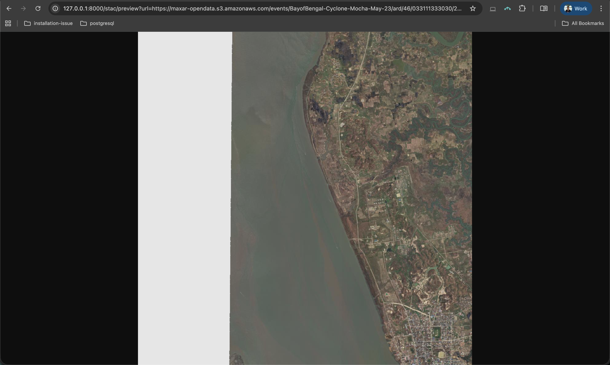
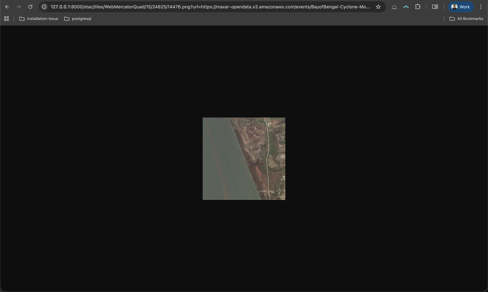
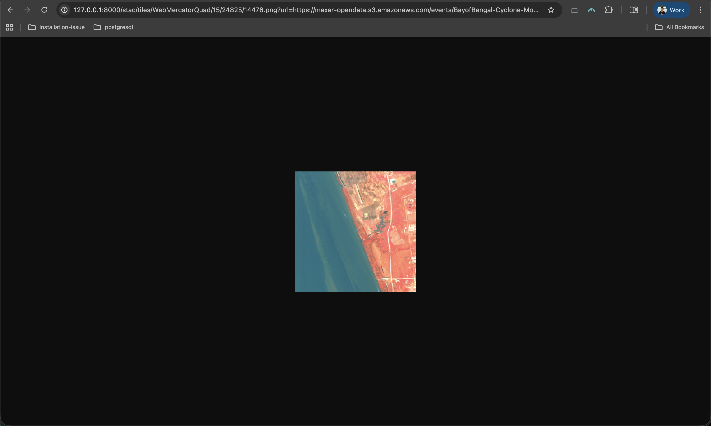
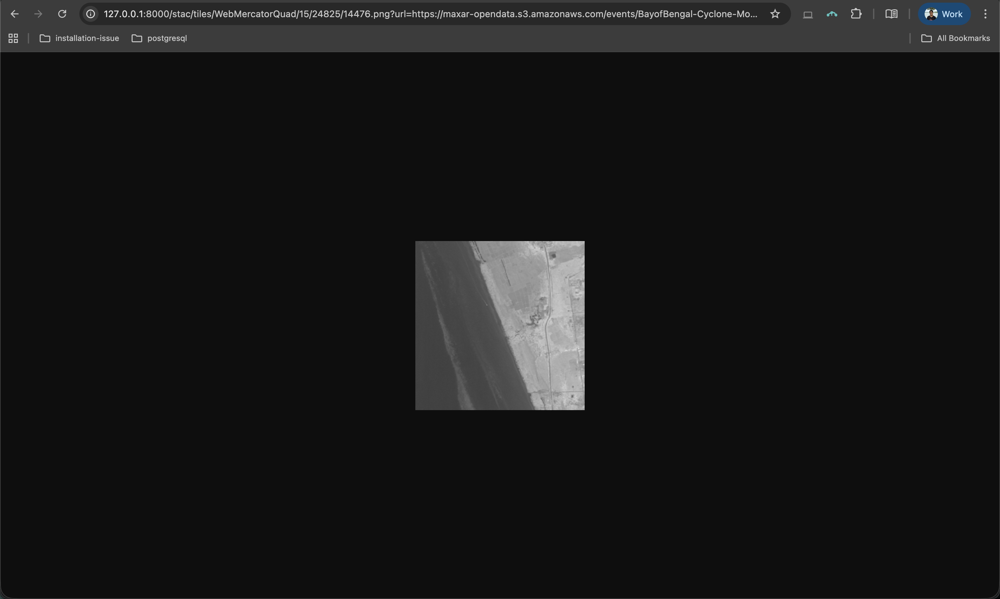

In our [previous post](https://developmentseed.org/titiler/user_guide/getting_started/), we set up TiTiler for serving Cloud-Optimized GeoTIFFs. Now let's explore how TiTiler works with STAC (SpatioTemporal Asset Catalog) - a standardized way to describe and organize geospatial data.

> **Prerequisites**: For Python environment and TiTiler setup, check out the [Getting Started with TiTiler](https://developmentseed.org/titiler/user_guide/getting_started/#lets-get-titiler-up-and-running) post.

## What is [STAC](https://stacspec.org/en)?

STAC is like a library catalog for satellite imagery. Instead of searching through folders, you get structured JSON files that tell you:

- **What**: Type of imagery, bands available, resolution
- **Where**: Geographic location (bounding box, geometry)
- **When**: Capture date and time
- **How**: Direct links to the actual data files (assets)

## Our Example Dataset

Throughout this tutorial, we'll use openly available Maxar satellite imagery from the Bay of Bengal Cyclone Mocha event:
```bash
https://maxar-opendata.s3.amazonaws.com/events/BayofBengal-Cyclone-Mocha-May-23/ard/46/033111333030/2023-05-22/10300110E84B5A00.json
```

This STAC item contains:

| Asset | Description | Bands |
|-------|-------------|-------|
| `visual` | True color RGB | Red, Green, Blue |
| `ms_analytic` | Multispectral | Coastal, Blue, Green, Yellow, Red, RedEdge, NIR1, NIR2 |
| `pan_analytic` | Panchromatic | Single band (high resolution) |
| `data-mask` | Valid data mask | Single band |


> **Tip**: Explore other open datasets at [STAC Index](https://stacindex.org/catalogs) to practice with different imagery

## Setting Up TiTiler for STAC

Make sure your `main.py` includes the STAC router:

```python
from fastapi import FastAPI
from titiler.core.factory import TilerFactory, MultiBaseTilerFactory
from starlette.middleware.cors import CORSMiddleware
from rio_tiler.io import STACReader

app = FastAPI(title="TiTiler")

app.add_middleware(
    CORSMiddleware,
    allow_origins=["*"],
    allow_credentials=True,
    allow_methods=["*"],
    allow_headers=["*"],
)

# COG endpoints
cog = TilerFactory()
app.include_router(cog.router, prefix="/cog", tags=["COG"])

# STAC endpoints
stac = MultiBaseTilerFactory(reader=STACReader)
app.include_router(stac.router, prefix="/stac", tags=["STAC"])

@app.get("/")
def read_index():
    return {"message": "Welcome to TiTiler!"}
```

**What's new for STAC**: We import `STACReader` from `rio_tiler.io` and use `MultiBaseTilerFactory` (instead of `TilerFactory`) to create STAC endpoints - this factory understands how to read multiple assets from a single STAC item.

Start the server:
```bash
uvicorn main:app --reload
```

Open your browser and go to:
```  http://127.0.0.1:8000/docs ``` - Explore the interactive API documentation.


***

## 1. Getting STAC Item Info `/stac/info`:

Before visualizing, let's understand what's in our STAC item. The `/stac/info` endpoint returns metadata about available assets and their properties.

### Basic Info Request

```bash
http://127.0.0.1:8000/stac/info?url=https://maxar-opendata.s3.amazonaws.com/events/BayofBengal-Cyclone-Mocha-May-23/ard/46/033111333030/2023-05-22/10300110E84B5A00.json
```

### Info for Specific Asset

To get detailed information about a specific asset:

```bash
http://127.0.0.1:8000/stac/info?url=https://maxar-opendata.s3.amazonaws.com/events/BayofBengal-Cyclone-Mocha-May-23/ard/46/033111333030/2023-05-22/10300110E84B5A00.json&assets=visual
```


***

## 2. Quick Preview: `/stac/preview`

The `/stac/preview` endpoint generates a downsampled image of your data - perfect for quick visualization.

### Preview the Visual Asset (RGB)

```bash
http://127.0.0.1:8000/stac/preview?url=https://maxar-opendata.s3.amazonaws.com/events/BayofBengal-Cyclone-Mocha-May-23/ard/46/033111333030/2023-05-22/10300110E84B5A00.json&assets=visual
```

True Color visual asset:


### Preview with Output Format

You can specify the output format:

```bash
# JPEG output (smaller file size)
http://127.0.0.1:8000/stac/preview.jpg?url=https://maxar-opendata.s3.amazonaws.com/events/BayofBengal-Cyclone-Mocha-May-23/ard/46/033111333030/2023-05-22/10300110E84B5A00.json&assets=visual

# WebP output (modern format, good compression)
http://127.0.0.1:8000/stac/preview.webp?url=https://maxar-opendata.s3.amazonaws.com/events/BayofBengal-Cyclone-Mocha-May-23/ard/46/033111333030/2023-05-22/10300110E84B5A00.json&assets=visual
```

***

## 3. Map Tiles: `/stac/tiles/{tileMatrixSetId}/{z}/{x}/{y}`

For web maps, you need tiles - small image pieces that load progressively as users pan and zoom. This is the most powerful endpoint for building interactive maps.

### Finding Tile Coordinates (Z, X, Y)

To request a specific tile, you need to know its coordinates. You can calculate these from the STAC item's bounding box using the `mercantile` library.

**Important**: STAC items have two types of bounding boxes:

- **`bbox`** - Always in WGS84 (lon/lat) - **use this for tile calculations**
- **`proj:bbox`** - In the asset's projection (e.g., UTM meters) - don't use this directly

```python
import httpx
import mercantile

# Fetch the STAC item
stac_url = "https://maxar-opendata.s3.amazonaws.com/events/BayofBengal-Cyclone-Mocha-May-23/ard/46/033111333030/2023-05-22/10300110E84B5A00.json"
item = httpx.get(stac_url).json()

# Get the WGS84 bbox (not proj:bbox!)
bbox = item["bbox"]  # [92.724, 20.481, 92.761, 20.530]

# Calculate center point
lon = (bbox[0] + bbox[2]) / 2  # 92.743
lat = (bbox[1] + bbox[3]) / 2  # 20.506
zoom = 15

# Get the tile containing this point
tile = mercantile.tile(lon, lat, zoom)
print(f"z={tile.z}, x={tile.x}, y={tile.y}")
# Output: z=15, x=24825, y=14476
```

> **Tip**: Install mercantile with `pip install mercantile`

### Basic Tile Request

```bash
http://127.0.0.1:8000/stac/tiles/WebMercatorQuad/15/24825/14476.png?url=https://maxar-opendata.s3.amazonaws.com/events/BayofBengal-Cyclone-Mocha-May-23/ard/46/033111333030/2023-05-22/10300110E84B5A00.json&assets=visual
```



**URL breakdown**:

- `WebMercatorQuad`: Standard web map projection (EPSG:3857)
- `15`: Zoom level
- `24825`: X tile coordinate
- `14476`: Y tile coordinate
- `.png`: Output format

### Using `assets` Parameter

The `assets` parameter specifies which asset(s) to render:

```bash
# Single asset (visual - RGB)
&assets=visual

# Multiple assets (for band combinations from different assets)
&assets=ms_analytic&assets=pan_analytic
```

### Using `asset_bidx` - Band Selection

When working with multi-band asset, use `asset_bidx` to select specific bands:

```bash
# Select band 3 (Green) from ms_analytic
http://127.0.0.1:8000/stac/tiles/WebMercatorQuad/15/24825/14476.png?url=https://maxar-opendata.s3.amazonaws.com/events/BayofBengal-Cyclone-Mocha-May-23/ard/46/033111333030/2023-05-22/10300110E84B5A00.json&assets=ms_analytic&asset_bidx=ms_analytic|3
```

**Band indices for `ms_analytic`**:

| Index | Band Name | Common Name |
|-------|-----------|-------------|
| 1 | BAND_C | Coastal |
| 2 | BAND_B | Blue |
| 3 | BAND_G | Green |
| 4 | BAND_Y | Yellow |
| 5 | BAND_R | Red |
| 6 | BAND_RE | Red Edge |
| 7 | BAND_N | NIR (Near Infrared) |
| 8 | BAND_N2 | NIR2 |

### Creating RGB Composites with `asset_bidx`

Create false-color composites by specifying 3 bands:

```bash
# Natural Color (Red, Green, Blue - bands 5,3,2)
&assets=ms_analytic&asset_bidx=ms_analytic|5,3,2

# False Color Infrared (NIR, Red, Green - bands 7,5,3)
&assets=ms_analytic&asset_bidx=ms_analytic|7,5,3

# Agriculture (NIR, Green, Blue - bands 7,3,2)
&assets=ms_analytic&asset_bidx=ms_analytic|7,3,2
```

### Using `rescale` - Adjust Value Range

**Important**: Raw satellite data often has values outside the 0-255 display range. Without rescaling, images may appear black or washed out.

> **Tip**: If your image appears black or too dark, try adjusting the rescale max value. Adjust based on your data min-max.

**Full example - False Color Infrared with rescale**:
```bash
http://127.0.0.1:8000/stac/tiles/WebMercatorQuad/15/24825/14476.png?url=https://maxar-opendata.s3.amazonaws.com/events/BayofBengal-Cyclone-Mocha-May-23/ard/46/033111333030/2023-05-22/10300110E84B5A00.json&assets=ms_analytic&asset_bidx=ms_analytic|7,5,3&rescale=0,2000
```



### Using `expression` - Band Math

The `expression` parameter lets you perform calculations across bands. This is powerful for creating vegetation indices, water indices, and more.

**Syntax**: Bands are referenced as `asset_name_b{index}` (e.g., `ms_analytic_b7` for NIR band).

> **Warning**: The `+` sign in URLs is interpreted as a space! Use `%2B` instead of `+` in your expressions, otherwise you'll get a syntax error.

#### NDVI (Normalized Difference Vegetation Index)

NDVI highlights vegetation: `(NIR - Red) / (NIR + Red)`

```bash
http://127.0.0.1:8000/stac/tiles/WebMercatorQuad/15/24825/14476.png?url=https://maxar-opendata.s3.amazonaws.com/events/BayofBengal-Cyclone-Mocha-May-23/ard/46/033111333030/2023-05-22/10300110E84B5A00.json&assets=ms_analytic&expression=(ms_analytic_b7-ms_analytic_b5)/(ms_analytic_b7%2Bms_analytic_b5)&rescale=-1,1
```



#### NDWI (Normalized Difference Water Index)

NDWI highlights water bodies: `(Green - NIR) / (Green + NIR)`

```bash
http://127.0.0.1:8000/stac/tiles/WebMercatorQuad/15/24825/14476.png?url=https://maxar-opendata.s3.amazonaws.com/events/BayofBengal-Cyclone-Mocha-May-23/ard/46/033111333030/2023-05-22/10300110E84B5A00.json&assets=ms_analytic&expression=(ms_analytic_b3-ms_analytic_b7)/(ms_analytic_b3%2Bms_analytic_b7)&rescale=-1,1
```

#### Simple Band Ratio

```bash
# NIR/Red ratio (vegetation vigor)
&expression=ms_analytic_b7/ms_analytic_b5
```

### Using `colormap_name` - Apply Color Palettes

When using expressions (which return single-band results), apply colormaps to make the data meaningful:

**[List of Available colormaps](https://titiler.xyz/colorMaps)**

#### NDVI with Colormap

```bash
http://127.0.0.1:8000/stac/tiles/WebMercatorQuad/15/24825/14476.png?url=https://maxar-opendata.s3.amazonaws.com/events/BayofBengal-Cyclone-Mocha-May-23/ard/46/033111333030/2023-05-22/10300110E84B5A00.json&assets=ms_analytic&expression=(ms_analytic_b7-ms_analytic_b5)/(ms_analytic_b7%2Bms_analytic_b5)&colormap_name=rdylgn&rescale=-1,1
```

- `colormap_name=rdylgn`: Red-Yellow-Green colormap (red=low NDVI, green=high NDVI)
- `rescale=-1,1`: NDVI values range from -1 to 1

#### Water Index with Blue Colormap

```bash
http://127.0.0.1:8000/stac/tiles/WebMercatorQuad/15/24825/14476.png?url=https://maxar-opendata.s3.amazonaws.com/events/BayofBengal-Cyclone-Mocha-May-23/ard/46/033111333030/2023-05-22/10300110E84B5A00.json&assets=ms_analytic&expression=(ms_analytic_b3-ms_analytic_b7)/(ms_analytic_b3%2Bms_analytic_b7)&colormap_name=blues&rescale=-1,1
```

### Visualize at the Image Extent or Crop to Custom Bounds

**NDVI on Image Extent**
```bash
http://127.0.0.1:8000/stac/bbox/92.724,20.481,92.761,20.530.png?url=https://maxar-opendata.s3.amazonaws.com/events/BayofBengal-Cyclone-Mocha-May-23/ard/46/033111333030/2023-05-22/10300110E84B5A00.json&assets=ms_analytic&expression=(ms_analytic_b7-ms_analytic_b5)/(ms_analytic_b7%2Bms_analytic_b5)&colormap_name=rdylgn&rescale=-1,1
```


**URL breakdown:**

  - `/stac/bbox/92.724,20.481,92.761,20.530.png` - Bounding box: `minLon,minLat,maxLon,maxLat`                                                 
  - Get these values from the STAC item's `bbox` field

***
### Using with Leaflet

```html
<!DOCTYPE html>
<html>
<head>
  <title>STAC + TiTiler Map</title>
  <link rel="stylesheet" href="https://unpkg.com/leaflet@1.9.4/dist/leaflet.css" />
  <script src="https://unpkg.com/leaflet@1.9.4/dist/leaflet.js"></script>
</head>
<body>
  <div id="map" style="width: 100%; height: 600px;"></div>
  <script>
    var map = L.map('map').setView([20.506, 92.743], 14);

    // Base map
    L.tileLayer('https://{s}.tile.openstreetmap.org/{z}/{x}/{y}.png', {
      attribution: '&copy; OpenStreetMap'
    }).addTo(map);

    // TiTiler STAC layer
    var stacUrl = 'https://maxar-opendata.s3.amazonaws.com/events/BayofBengal-Cyclone-Mocha-May-23/ard/46/033111333030/2023-05-22/10300110E84B5A00.json';
    var tileUrl = `http://127.0.0.1:8000/stac/tiles/WebMercatorQuad/{z}/{x}/{y}.png?url=${encodeURIComponent(stacUrl)}&assets=visual`;

    L.tileLayer(tileUrl, {
      opacity: 0.8,
      maxZoom: 18
    }).addTo(map);
  </script>
</body>
</html>
```

**To view the map:**

  1. Save the code as `map.html`                                                
  2. Make sure TiTiler server is running (`uvicorn main:app --reload`)          
  3. Open `map.html` in your browser (double-click or drag into browser)


## Common Issues

**Asset not found**: Check asset names in the STAC item JSON - they're case-sensitive.

**Black/white tiles**: Your data values might be outside the default range. Use `rescale` to adjust.

**Slow tiles**: Large files take time. Consider using overviews or lower zoom levels for previews.

**Expression errors**: Make sure band references match exactly: `assetname_b{number}`.

---
*Created by [Dimple Jain](https://jaiindimple.github.io)*